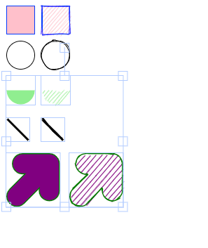

ripple-anything.js
========
[![NPM Package][npm]][npm-url]
[![Build Size][build-size]][build-size-url]

#### Combine roughjs with fabricjs ####

added RoughRect, RoughCircle, RoughPath, RoughLine, RoughArc basic class for fabric

[play on stackblitz](https://stackblitz.com/edit/fabric-rough?file=index.tsx)

#### Demo ####

#### Related ####

[rough](https://github.com/rough-stuff/rough/blob/master/README.md)

[fabric](https://github.com/fabricjs/fabric.js/blob/master/README.md)

[npm]: https://img.shields.io/npm/v/fabric-rough
[npm-url]: https://www.npmjs.com/package/fabric-rough
[build-size]: https://badgen.net/bundlephobia/minzip/fabric-rough
[build-size-url]: https://bundlephobia.com/package/fabric-rough
